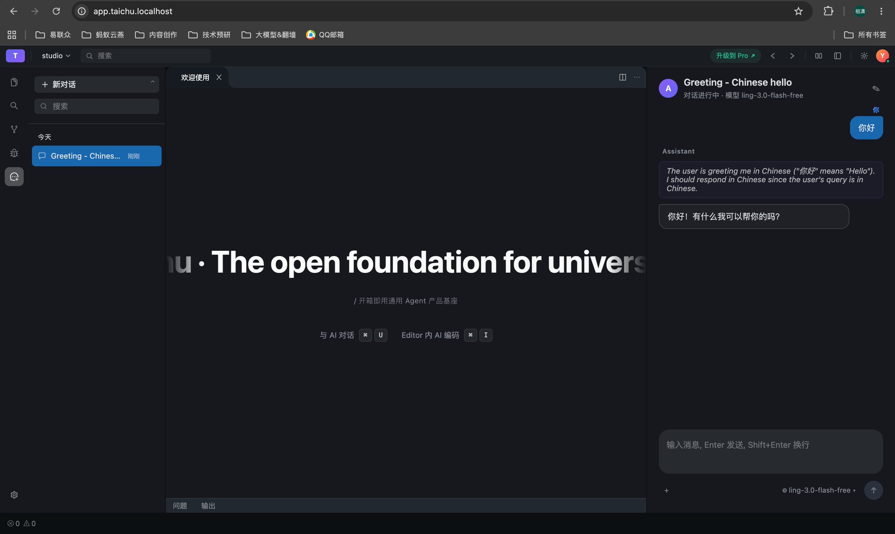

# Taichu（太初）

> 开箱即用的通用 Agent 产品基座。**胶水哲学**为项目核心思想：平台本身不重复造底层基础设施、不固化业务功能，仅作为标准化连接层。

## 这是什么

Taichu（太初）是一套把成熟开源组件（OpenSumi / OpenCode / Kubernetes）粘合起来、按多租户 SaaS 标准组织起来的产品基座。目标是：业务方只需**新增插件、调整配置**，即可快速落地可运营的 Agent 产品，不必再从零搭建容器调度、SSE 通道、插件分发、用户隔离等基础设施。

平台分为三个互相解耦的平面：

- **交互平面**：浏览器侧 OpenSumi/CodeBlitz 纯前端容器，业务全部由 VSIX 扩展承载。
- **调度平面**：Spring Cloud Gateway + K8s 编排，按用户/租户隔离沙箱。
- **Agent 运行平面**：标准化 Docker 镜像 + OpenCode 运行时，按需加载业务 Agent 插件。

## 模块划分

| 模块 | 路径 | 职责 | 技术栈 |
|------|------|------|--------|
| **client** | [`client/`](./client/) | 交互平面底层容器宿主；纯前端标准化交互底座 | OpenSumi/CodeBlitz、纯浏览器 |
| **extensions** | [`extensions/`](./extensions/) | 业务 VSIX 源码；按 VS Code 兼容扩展标准开发，独立于 client 上架到 registry | TypeScript + VSIX Manifest |
| **registry** | [`registry/`](./registry/) | VSIX 插件资产分发中心；版本管控、灰度、CDN | Spring Boot、MySQL、Redis、OSS、CDN |
| **gateway** | [`gateway/`](./gateway/) | 全局调度平面；流量网关 + K8s 运行时编排中枢 | Spring Cloud Gateway、WebFlux、Fabric8、Redis |
| **agent-image** | [`agent-image/`](./agent-image/) | Agent 运行平面最小隔离单元；单用户独享 Pod 沙箱 | 标准化 Docker 镜像、OpenCode、MCP、A2UI |

产品形态与核心价值见 [`功能设计.md`](./功能设计.md)；技术架构、分层结构、模块设计、VSIX 生命周期、接口契约、部署架构见 [`架构设计.md`](./架构设计.md)。

## 运行示例

本地 K8s 全栈启动后，浏览器访问 `http://app.taichu.localhost` 即可看到上图所示界面：左侧会话列表、中央编辑器欢迎页（marquee 大字标题）、右侧 Agent 对话面板；右上角为用户头像与 GitHub OAuth 登录入口。

## 致谢

- [OpenSumi](https://opensumi.com) / [CodeBlitz](https://github.com/opensumi/codeblitz) — 浏览器内 IDE 内核与扩展宿主。
- [OpenCode](https://opencode.ai) — Agent 运行时与 MCP / A2UI 协议。
- [Kubernetes](https://kubernetes.io) / [Fabric8](https://fabric8.io) — 容器编排与 Java 客户端。
- [Spring Cloud Gateway](https://spring.io/projects/spring-cloud-gateway) / [Spring WebFlux](https://spring.io) — 反应式网关。
- [Trae](https://www.trae.ai) — 容器布局与深色 UI 风格参考。