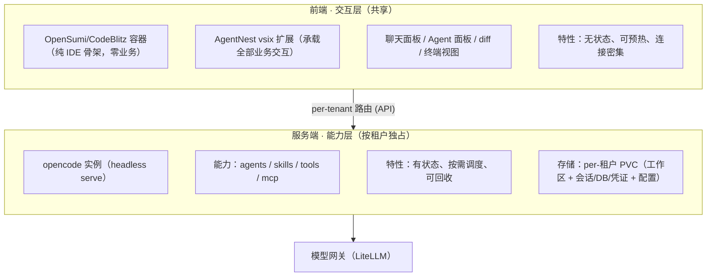

# AgentNest 架构讨论文档

> 状态：**讨论阶段（Draft）** · 工作名：**AgentNest**
> 本文档记录方案的架构设计、技术选型、关键权衡与待验证点，用于对齐认知，尚未进入实施。

---

## 1. 项目目标

构建一个**浏览器级、多租户的云端 AI IDE 平台**：

- 用户通过浏览器访问，获得接近 VS Code 的完整开发交互体验；
- 平台内置 AI Agent 能力（对话、代码生成、自主改文件、跑命令、调用工具）；
- 通过 Kubernetes 调度，按租户提供隔离的 Agent 能力实例；
- 以开源组件为基础（opencode / OpenSumi），可商用、可魔改。

### 参照物
- **Cursor / Trae**：桌面单机 AI IDE（fork VS Code + 云端模型）。
- **本项目差异**：不是桌面单机，而是**云端多租户**——复杂度高一个数量级，调度 / 隔离 / 状态 / 成本 / 路由都需自建。

---

## 2. 核心分层架构

系统采用**前后端分离**，两层职责彻底解耦：

### 2.1 前端交互层（共享）
- **技术**：OpenSumi/CodeBlitz 纯前端容器（`@codeblitzjs/ide-core`，基于 OpenSumi 3.6.5，react18，含 ai-native）+ 自研 AgentNest vsix 扩展。
- **容器定位**：纯 IDE 骨架，**零业务**——只提供编辑器、布局、文件树、扩展宿主、终端宿主等通用能力。
- **vsix 定位**：**承载全部前端业务交互**，交互形态由 vsix 定义。
  - 会话管理（左侧功能区）、对话窗口（右侧辅助栏）、工具调用/任务/diff 展示、规范开发行为。
  - 作为 client 调用后端 opencode 实例的 API（`createOpencodeClient`，`--cors` 直连）。
  - **不含 Agent 推理逻辑**（那在 opencode）；负责会话状态管理 + UI 渲染 + 指令下发。
- **文件系统**：CodeBlitz 用 BrowserFS 风格，`DynamicRequest`（只读）接 opencode `/file*`；写回走 `runtimeConfig.workspace.onDidSaveTextDocument` 等回调，映射到 opencode 写通道。
- **特性**：无状态、可共享、连接密集但 CPU 轻。

### 2.2 服务端能力层（按租户独占）
- **技术**：opencode 以 headless `serve` 模式运行，暴露 HTTP + SSE API。
- **能力**：集成 agents / skills / tools / mcp。
- **特性**：按用户 / 租户**独占实例**，保证隔离与状态；有状态、可按需调度、空闲回收。
- **持久化（per-租户 PVC，实测容器内三处路径）**：
  - `/workspace` — 租户代码 + 项目级扩展 `.opencode/`
  - `/root/.local/share/opencode` — 会话 / 数据库 / snapshot / 凭证 auth.json（租户私有状态）
  - `/root/.config/opencode` — opencode.json + 全局级扩展（agents/skills/tool/plugin）；可全局共享或按租户覆盖

### 2.3 模型网关
- 统一走一个模型网关（LiteLLM），opencode 实例配置指向它。
- 好处：集中管理 API Key、计费、限流、按租户配额；避免每个实例直连各家模型 API。

---

## 3. Kubernetes 调度设计

### 3.1 场景与约束（已确认）
| 维度 | 选择 |
|------|------|
| 使用场景 | 多租户 SaaS 产品 |
| 工作区状态 | 持久化（每用户 PVC） |
| 隔离级别 | 普通隔离（可信用户）：标准容器 + namespace 资源配额 + NetworkPolicy，不上 gVisor/Kata |

### 3.2 会话路由
- 会话表：`tenant/user → opencode 实例地址`（存 Redis）。
- 网关按 subdomain（子域名）解析租户 → 转发到对应后端 Service / Pod。
- 需处理 SSE 长连接的重连与会话恢复。

### 3.3 生命周期
- opencode 独占实例按用户 / 租户创建。
- 空闲 TTL（建议 15–30 分钟）后回收，避免频繁冷启动。
- 状态在 PVC 上，Pod 可销毁重建，卷重挂即恢复。

### 3.4 安全隔离（普通级）
- 每 Pod 独立资源配额（CPU / mem / pids limit + 命令超时），防 Agent 资源失控。
- NetworkPolicy 限制 Pod 仅可访问模型网关与必要出网，防止 Agent 乱扫内网。

---

## 4. 关键技术权衡

### 4.1 冷启动（核心痛点）
分离架构后，前端常驻共享，**冷启动只剩后端 opencode 实例**——它无 UI、镜像小，优化空间大。

治理手段（按性价比）：
1. **Warm Pool**：预启动一批就绪的 opencode 实例，用户来了绑定工作区即可用。
2. **镜像瘦身 + 节点预拉取**：多阶段构建；DaemonSet 预热镜像，避免现拉。
3. **延迟回收 / 会话复用**：用户断开不立即杀，空闲 TTL 内复用 = 零冷启动。
4. **进程层优化**：扩展懒激活；opencode 代码库索引异步后台做，不阻塞就绪。

### 4.2 文件系统跨层共享（分离后最硬的问题）
前端要显示 / 编辑代码，后端 opencode 要读写同一份代码，两层不在一个 Pod、不共享磁盘。

**决策建议**：**workspace 真身归属后端 opencode 独占实例**（PVC 挂在这层最自然，与"按租户独占 + 有状态"完全吻合）。前端通过 CodeBlitz 的 `DynamicRequest`（只读文件系统）远程读取，写回走 `onDidSaveTextDocument` 等回调映射到 opencode 写通道。
- 优点：PVC 只挂后端，前端保持纯无状态共享，分层干净。
- 风险：大项目下远程文件系统的性能与 diff 体验会打折，需实测。

其他备选（暂不推荐）：
- RWX 共享卷（两层挂同一卷）：简单但共享存储性能 / 隔离顾虑。
- 各自本地盘 + 同步：一致性问题大。

### 4.3 前端"共享应用实例"的真实粒度（待明确）
OpenSumi/CodeBlitz 纯前端本质是单工作区，原生不为多租户设计。需明确"共享应用实例"是：
- 真·单进程多租户（**非常难**，不推荐），还是
- **共享网关 + 每用户轻量前端进程池**（业界常规做法，推荐）。

### 4.4 PVC(RWO) 与 Warm Pool 的天然冲突
RWO PVC 必须在 Pod 调度时确定挂载，而 warm pod 提前启动时还不知服务哪个用户。
- 分离架构下此冲突被大幅缓解：前端无状态可自由预热，PVC 只在后端；后端 warm pool 仍需解决"绑定用户时挂 PVC"的问题（重建 / CSI 动态挂载 / RWX 待选）。

---

## 5. 最大风险与可行性判断

### 5.1 头号风险：opencode 的 server API 开放度 ⚠️（已核实 ✅）
- opencode 自带完整 TUI / 客户端与交互逻辑。本方案要求"只用其服务端能力、交互全换成自研 vsix"。
- **关键未知**：opencode 的 server API 是否**足够全、足够稳、足够开放**，能支撑对话流、文件操作、Agent 状态、工具调用展示的完整交互？
- 若 API 是为自身客户端设计、不够开放，将陷入大量二次开发甚至改源码。
- **这是整个方案的地基，此前尚未核实。**
- **调研结论（详见《opencode-server-api调研.md》）**：✅ 已证实解除。本地 v1.18.8 真实 OpenAPI spec 有 188 个端点，四大交互闭环全部端到端实测跑通。前一版调研"无写文件 API"的结论经实测为错误，写文件至少有 Agent write tool 和 PTY 终端两条通道。

### 5.2 可行性评估
| 维度 | 评价 |
|------|------|
| 架构合理性 | 高，分层清晰 |
| 技术可行性 | 中高，**卡在 opencode API 开放度** |
| 工作量 | 大，尤其后端调度 + 文件系统 |
| 最该先验证的 | opencode server API 能力边界 |

**结论**：方向可行，但需先做减法验证，不要一上来搞 K8s。

---

## 6. 建议的验证路径（MVP Spike）

> 目标：用最小成本证伪 / 证实方案地基。

1. **本地起 opencode serve + 最简 vsix 扩展**，验证能否仅靠 API 完成核心交互闭环：
   - 对话（SSE 流式）
   - 看文件 / 改文件
   - 跑 Agent 任务
   - 展示工具调用与 diff
2. 若通过 → 后续 K8s、多租户、warm pool 都是工程量问题，非可行性问题。
3. 若卡住 → 说明 opencode 不适合被这样驱动，需趁早换 Agent 内核（如 OpenHands 等 API 更开放的方案）。

---

## 7. 待决策 / 待确认清单

- [x] **核实 opencode server API 能力边界**（最高优先，可行性地基）→ ✅ 已实测完成，见《opencode-server-api调研.md》
- [x] **人工编辑文件回写通道** → ✅ 已解除疑虑：Agent write tool / PTY 终端均实测可落盘（`/vcs/apply` 为边缘方案）
- [x] **前端内核选型** → ✅ 定为 OpenSumi/CodeBlitz（`@codeblitzjs/ide-core`，基于 OpenSumi 3.6.5），见《opensumi-opencode前后端分离调研.md》
- [ ] "共享应用实例"的真实粒度（单进程多租户 vs 前端进程池）
- [x] **文件系统方案** → ✅ 真身在后端 opencode，前端 CodeBlitz `DynamicRequest` 只读 + 保存回调写回
- [x] **agents/skills/tools/mcp 注入方式** → ✅ 实测：全局级 `config/` + 项目级 `/workspace/.opencode/` 均可加载；每租户配置注入（非定制镜像）
- [ ] 规模预期（并发用户数）→ 影响 warm pool 与成本设计
- [ ] vsix 分发方式（Open VSX / 自建 registry / 镜像预装）
- [ ] 并发规模下的成本模型（空闲 Pod 回收策略）

---

## 8. 技术选型速查

| 层 | 组件 | 协议 | 备注 |
|----|------|------|------|
| 前端内核 | OpenSumi/CodeBlitz（`@codeblitzjs/ide-core`） | MIT | 纯前端容器，基于 OpenSumi 3.6.5 |
| 前端扩展 | AgentNest vsix | — | 自研，承载全部前端业务交互 |
| 能力层 | opencode | MIT | headless serve |
| BFF 网关 | agent-gateway（Spring Cloud Gateway） | — | 生产阶段：K8s 调度 + 反代 + 配置注入（独立项目，POC 不涉及） |
| 模型网关 | LiteLLM | MIT | 集中管理 key/计费/限流 |
| 编排 | Kubernetes | — | 按租户调度独占实例 |
| 会话存储 | Redis | — | 会话路由表 |
| 持久化存储 | per-租户 PVC (RWO) | — | 工作区 + 会话/DB/凭证 + 配置，均挂后端能力层 |

---

*本文档随讨论持续更新。*
