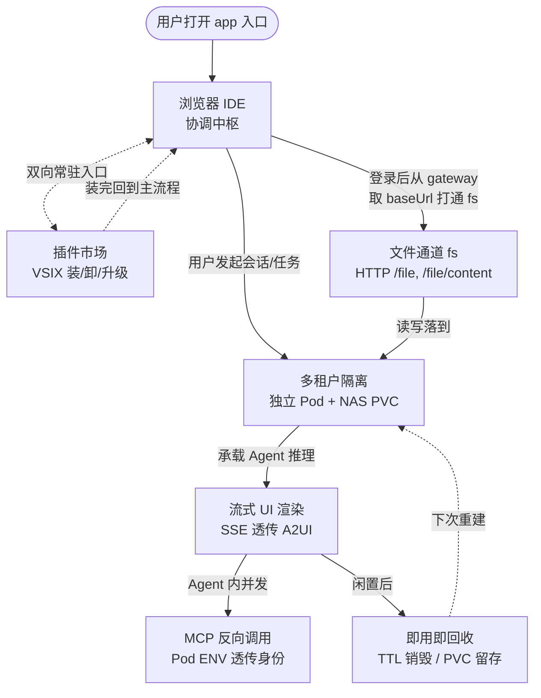

# 功能设计（太初 · 产品视角）

> 读者：产品经理、业务方、想理解太初"做什么 / 为什么 / 走完一遍什么样"的所有人。
> 配套文档：[`架构设计.md`](./架构设计.md)（技术视角，与本文件互引）。

本文档是太初产品形态的事实源。技术实现细节（模块拆分、接口契约、部署形态）放 [`架构设计.md`](./架构设计.md) —— 同一个系统的两面。

- **根仓库**：`taichu`
- **五个并列模块**：`client/` 交互平面、`extensions/` 业务 VSIX 源码、`registry/` 插件分发、`gateway/` 调度平面、`agent-image/` 运行平面
- **整体定位**：把 OpenSumi、OpenCode、Kubernetes 等成熟开源组件粘合起来，按多租户 SaaS 标准组织成一个产品基座
- **平台承诺**：不重复造底层基础设施、不固化业务功能，仅作为标准化连接层
- **架构特征**：三平面互相解耦、互不侵入内核

## 1. 定位目的

太初做一件事：让任何团队在不重复造容器调度、流式通道、插件分发、用户隔离的前提下，落地一个可运营的多租户 Agent 产品。

- **目标能力**：不重复造容器调度 / 流式通道 / 插件分发 / 用户隔离
- **行业痛点**
  - 选项 A：业务方被迫自己写 OpenCode 调度、网关鉴权、Pod 生命周期
  - 选项 B：被迫接手封装过重、动一行业务就牵连基座的"半成品平台"
- **太初选择**：走选项 A 的反面 —— 把横切关注点封装为四模块间的标准约定，业务侧只需要新增 VSIX 插件 + 调整配置

它服务的对象很清晰：

- 希望快速搭建可运营 Agent 产品、但不想被基础设施长期绑定的业务方
- 希望业务能力持续迭代、但希望基座十年不动的工程团队
- 希望复用 VS Code 扩展生态（含 OpenSumi/CodeBlitz 等兼容运行时）、又同时需要多租户隔离与企业级运维能力的产品组织

它对哪些事明确说不：

- 不实现具体业务逻辑（行业 Agent、行业 MCP 工具）
- 不内置 Agent 推理模型（由 agent-image 通过 LLM 网关调用）
- 不改写 OpenSumi/OpenCode/K8s 任何底层源码
- 不固化任何业务 UI

形态上是"三平面 + 插件市场"：交互平面 / 调度平面 / 运行平面互相解耦，业务通过 VSIX 插件承载；agent-image 的后端业务能力通过 OpenCode Plugin 承载。两套插件体系遵循行业标准，团队不需要学新东西。

## 2. 交互平面

交互平面是用户在浏览器里看到的全部内容 —— 一个标准的 IDE 容器，由 OpenSumi/CodeBlitz 内核驱动，自身不内置任何业务 UI，业务能力全部由 VSIX 注入。

### 2.1. 浏览器 IDE 体验

用户打开 IDE 入口即得到完整容器，骨架由基座提供，无需安装任何扩展：

- **顶部**：标题栏（品牌、工作区切换、搜索、版本/账户）
- **左侧**：文件资源管理器
- **中央**：代码编辑器 + 欢迎页
- **右侧**：Agent 对话窗口
- **底部**：输出面板 + 问题面板
- **底部栏**：状态栏

编辑器内核复用 VSCode 生态的成熟组件，用户不必切换工具栈：

- Monaco 编辑器
- 文件树
- Diff 视图
- Search
- SCM（源代码管理）

### 2.2. 布局与分区

IDE 容器由 OpenSumi/CodeBlitz 的布局系统划成 8 个常用分区(技术上框架支持 14 个槽位),每个分区是一个独立的渲染区域:

| 区域 | 用途 |
|------|------|
| 顶部标题栏 | 品牌、工作区切换、搜索、版本/账户 |
| 左侧活动栏 + 侧栏 | 资源管理器、搜索、源代码管理、调试器 |
| 中央编辑区 | 文件 Tab / Welcome / 编辑器主区 |
| 右侧栏 | Agent 对话窗口(由 chat-window VSIX 注入) |
| 底部面板 | 输出 / 问题 / 调试控制台 |
| 状态栏 | Launchpad / 错误计数 / Git 状态 |

> **槽位是 OpenSumi/CodeBlitz 的私有布局系统,不是 VSIX 标准。** VSIX 标准用 `contributes.views` + `contributes.viewsContainers` 注册视图容器;OpenSumi 通过 `sumiContributes.browserViews.{slot}` 这个扩展字段,把视图挂到自己的 slot 上。所以"VSIX 注入到 X 槽位"指的是 OpenSumi 扩展点 + 该 slot 名,不是 VSIX 标准字段。

VSIX 与 槽位 / 视图容器 的关系:

- **VSIX 标准字段**: `contributes.views` / `contributes.viewsContainers`(视图 id / 容器 id / title / icon / when)
- **OpenSumi 扩展字段**: `sumiContributes.browserViews.{slot}`(`type: add` 把视图挂到该 slot)
- **运行时入口**: VSIX `activate()` 阶段向 `LayoutService` / `CommandService` 注册贡献
- **运行时槽位**: `top` / `left` / `main` / `right` / `bottom` / `statusBar` / `action` / `extra` 等(框架私有)

### 2.3. 核心内置功能

交互平面除了渲染 IDE 骨架与装载 VSIX 之外，还承担三个**与后端基础设施直连的核心内置功能**（VSIX 不能做、也不必做）。

#### 前置流程：登录与会话建立

- 用户访问 IDE 入口后，触发登录（当前接入 GitHub OAuth）
- 登录成功后，交互平面立即向 gateway 发起 `POST /runtime`，由 gateway 校验身份并返回 baseUrl
- gateway 命中已有沙箱 → 直接返回 runtimeId + baseUrl；未命中 → 创建 Pod → 等待 SSE: READY → 返回 baseUrl
- 这一步是后续所有功能的前置条件：没有登录就拿不到 baseUrl，就没有 fs 通道，也没有 OpenCode SDK

#### 功能 1：fs 文件系统通道

- 拿到 baseUrl 后，交互平面**自动**与沙箱内文件系统建立连接（HTTP `/file`、`/file/content`、`/pty`）
- 交互平面把文件操作封装成**统一的 fs API 暴露给 VSIX**（列目录、读、写、建、删）
- **VSIX 不直接 fetch `${baseUrl}/file...`** —— 所有文件 IO 一律经 app 的 fs 客户端，VSIX 只调用 app 提供的命令或 API
- 整段 IDE 使用期间持续在线；会话失效或沙箱重建时 fs 通道跟着重连

#### 功能 2：OpenCode SDK 与事件流

- 交互平面在登录后用 baseUrl 实例化 OpenCode SDK 客户端，并把实例挂到一个稳定的全局（如 `window.__TAICHU_OPENCODE__`）供 VSIX 消费
- **VSIX 不直接 `import { createOpencodeClient } from '@opencode-ai/sdk'`** —— SDK 的生命周期、连接复用、错误重连由交互平面负责
- 交互平面同时实现 OpenCode `global/events` SSE 订阅，把事件通过 `window` 上的 event emitter 转发出去
- VSIX 用 `window.addEventListener('opencode:event', ...)` 消费这些事件（message.updated / message.part.updated / session.status / session.idle / session.error 等），不需要自己接 SSE

### 2.4. 业务能力如何注入

业务不是写进 IDE 内核,而是按 VSIX 标准开发后挂在某个槽位上:

- **会话管理**(左侧栏):由 `taichu-session-manager` VSIX 注入
- **对话窗口**(右侧栏):由 `taichu-chat-window` VSIX 注入
- **着陆页**(中央编辑区空态):由 `taichu-landing-page` VSIX 注入
- 用户在「插件市场」装卸/升级 VSIX 后,IDE 的对应槽位即时呈现新的视图 —— 这是"业务与基座解耦"的产品侧体现

> **VSIX 必须按 VS Code 兼容扩展标准开发**。VSIX 是 VS Code 扩展包格式（vsce / open-vsx 标准），OpenSumi/CodeBlitz 通过实现 VS Code 扩展协议来加载它；**不允许**把 VSIX 当成 OpenSumi 私有扩展标准来开发。`package.json` 强制声明 `engines.vscode`，业务能力走 `contributes.commands` / `contributes.views` 等 VS Code 标准字段；OpenSumi 扩展点（`sumiContributes.*`、slot 等）只在需要 OpenSumi 专属能力时作为补充，不替代 VS Code 标准字段。

交互平面只承担容器渲染、插件生命周期管控、跨模块消息中转,从不内置业务。

## 3. 功能设计

用户在平台上的端到端旅程是这样：

- **入口**：浏览器打开即获得 IDE，IDE 是整段旅程的协调中枢
- **登录 + fs 通道**：登录后 IDE 立即与 gateway 建立会话，从 gateway 取到自己 pod 的 baseUrl，打通一条到该 pod 的 fs 文件通道；编辑器内所有读写、MCP 工具落盘、Agent 生成的代码都经 fs 与后端沙箱同步
- **对话 / 任务**：进入对话或发起任务时，由 IDE 通过 gateway 拉起（或复用）独享沙箱承载 Agent 推理；Agent 经 MCP 反向调用外部业务服务、经 SSE 把 A2UI 流式渲染到前端
- **闲置回收 + 重建**：闲置后平台自动回收资源、保留 PVC 数据；下次访问秒级重建
- **常驻入口**：插件市场是 IDE 内的常驻入口，装卸或升级 VSIX 后回到 IDE 主流程，与 fs 一样不参与沙箱生命周期

这条旅程对应 7 项独立功能。

逐项展开：

- **浏览器 IDE**：浏览器打开 app 入口即可使用完整 IDE 容器，左侧文件资源管理、中央代码编辑与欢迎页、右侧 Agent 对话窗口——全部基础能力由交互平面原生提供，无需安装任何扩展
- **插件市场**：浏览、安装、升级、卸载业务 VSIX（例如会话管理、对话窗口等），每个扩展都是独立可发布的资产，与基座版本解耦
- **多租户隔离**：每个用户/租户独占一个 K8s Pod 作为沙箱，挂载独立 NAS PVC 存储工作区与配置；所有对话、任务、生成的代码都跑在自己的沙箱里，与其他用户物理隔离
- **文件通道**：用户登录后 IDE 与 gateway 完成会话建立，取到用户 pod 的 baseUrl 并打通一条到该 pod 的 fs 文件通道；编辑器内文件读写、MCP 工具落盘、Agent 落盘代码都经此通道与沙箱双向同步，整段 IDE 使用期间持续在线
- **即用即回收**：闲置超 TTL 阈值后沙箱自动销毁释放资源，PVC 数据留存，下次访问秒级重建环境
- **流式 UI 渲染**：对话过程走 SSE 长连接，Agent 服务端生成 A2UI 声明式组件描述，前端增量渲染，让用户感觉 Agent 真的在动手而不是堆叠文本
- **MCP 反向调用**：业务 Agent 通过 MCP 协议调用外部业务服务，用户身份由 Pod 环境变量透传，全程走统一鉴权链

## 4. 核心价值

太初的价值主张收敛到四点：

- 要**业务与基座解耦**：业务迭代等价于"新增 VSIX"，基座几乎不动，反过来基座升级也不会覆盖用户持久化配置。这条解耦支撑了一个常见但难以做到的承诺——业务侧不被基座的版本节奏卡脖子
- 要**多租户能力开箱即用**：用户隔离、Pod 调度、TTL 自动回收、PVC 数据留存、Ingress 反代、SSE 透传——这些特性不需要业务方从零设计，接入太初即获得
- 要**插件标准兼容**：前端沿用 VS Code 扩展生态（VSIX，OpenSumi/CodeBlitz 通过实现 VS Code 扩展协议加入该生态），后端复用 OpenCode Plugin 体系，两套都是行业通用标准，团队熟悉的开发模式直接迁移过来即可，不需要学习新的扩展机制
- 要**胶水不重复造轮子**：平台不去重写 OpenSumi、OpenCode、K8s、LLM 网关，只是把它们粘合起来。这意味着平台升级不会陷入 fork 维护的泥潭，跟随上游即可获得安全和性能更新

## 5. 业务流程（端到端）

太初的端到端用户旅程由 6 步构成：

1. 登录 + app 加载
2. runtime 创建或复用
3. fs 通道贯通（贯穿始终）
4. Agent 推理 + MCP 工具调用
5. A2UI 流式回写到前端
6. TTL 自动回收（PVC 数据留存）

每一步的时序、跨模块消息、状态机细节，以及"fs 文件通道如何贯穿始终"的时序图见 [`架构设计.md §4 业务流程`](./架构设计.md#4-业务流程)。

## 附录 术语与简称

| 术语 | 说明 |
|------|------|
| 太初 / Taichu | 本项目代号 |
| IDE | 浏览器侧集成开发环境（太初产品形态） |
| Runtime | 用户独享沙箱（业务方用语；技术实现见架构设计） |
| VSIX | **VS Code 扩展包格式**（vsce / open-vsx 标准），前端业务容器；OpenSumi/CodeBlitz 通过实现 VS Code 扩展协议来加载它 |
| OpenCode Plugin | OpenCode 后端插件（后端业务容器） |
| A2UI | Agent-to-UI 流式 UI 协议 |
| MCP | Model Context Protocol，Agent 反向调用外部业务服务 |
| SSE | Server-Sent Events |
| 多租户 | 每个用户/租户独享沙箱的隔离模型 |
| 即用即回收 | 闲置后沙箱销毁、PVC 数据留存 |
| 流式 UI | Agent 在服务端生成 A2UI 声明式组件，前端增量渲染 |
| 工作流总线 | app 全局 command ID，约定 `{publisher}.{name}:{action}` |