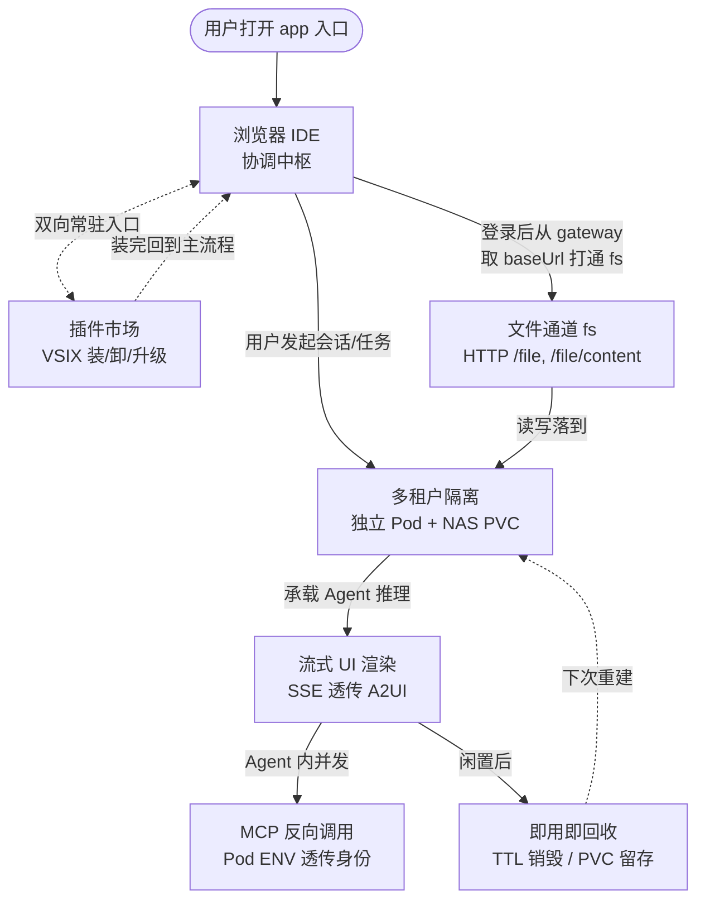
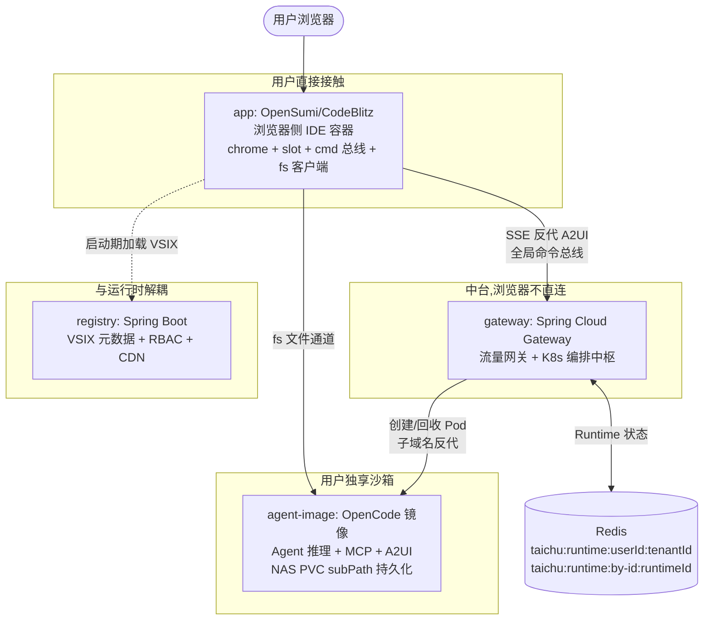
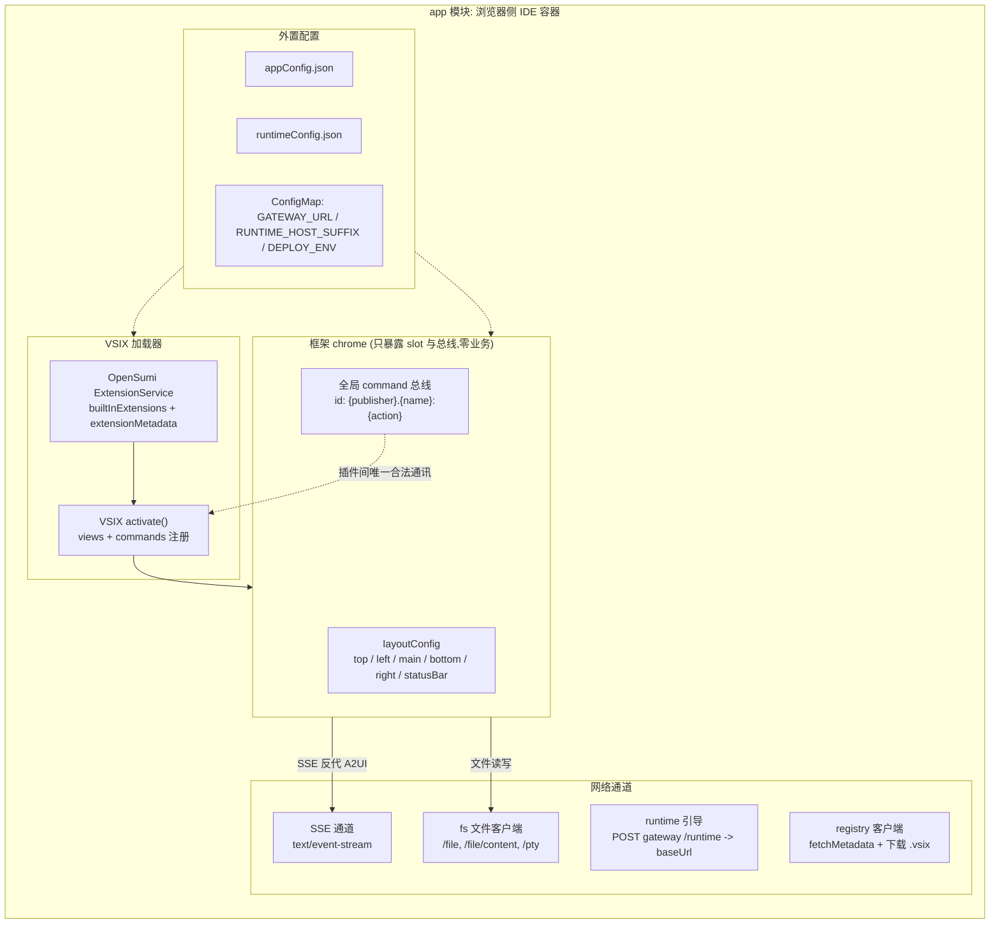
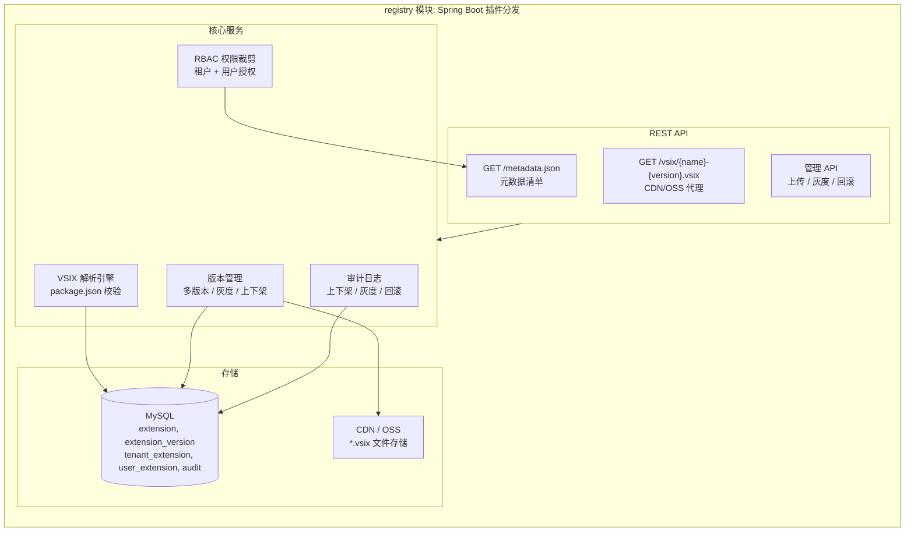
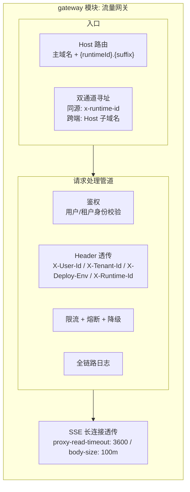
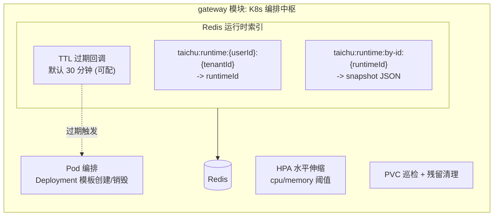
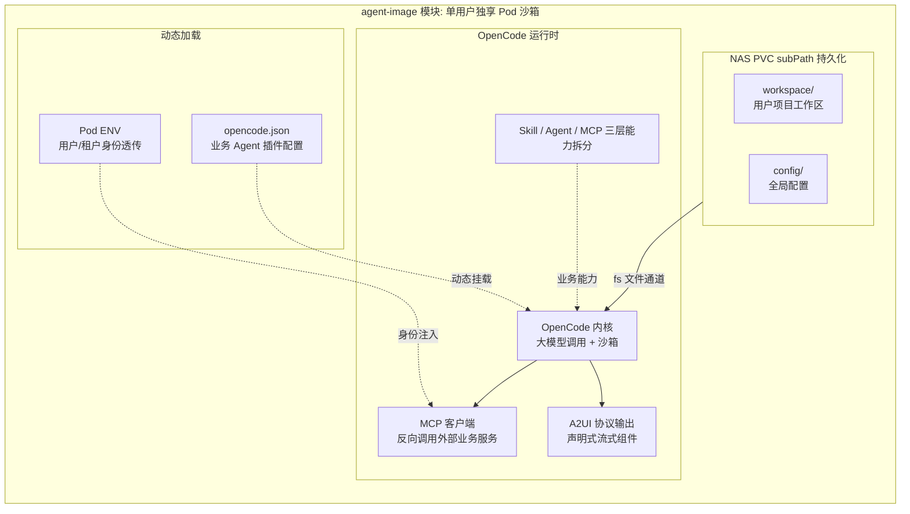
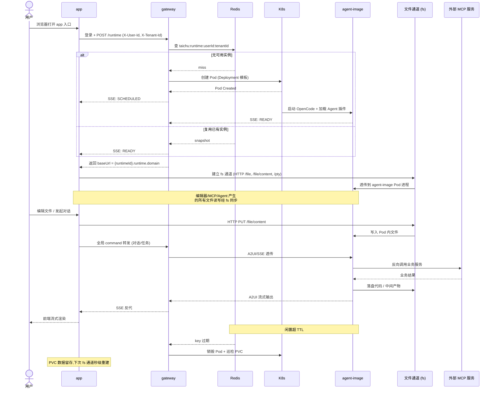
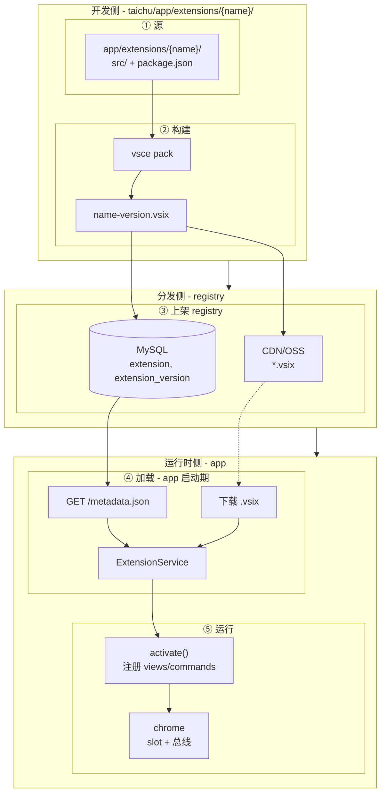
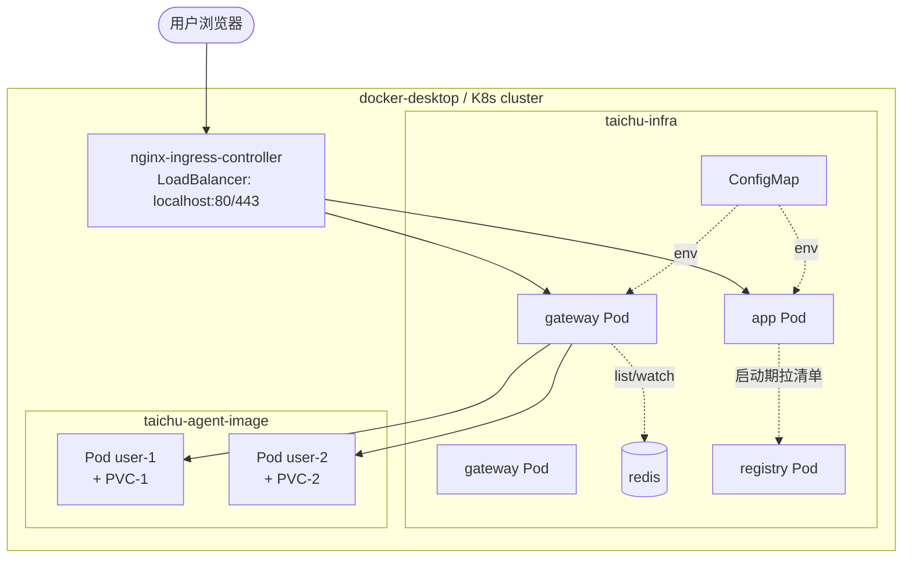

# 太初（Taichu）

> 开箱即用通用 Agent 产品基座 · **胶水哲学**为核心思想

本文档描述太初系统的产品定位与技术架构。读者：构建产品形态的产品经理、落地基座与业务的工程团队、对开源组件粘合方式感兴趣的技术决策者。

- **根仓库**：`taichu`
- **四个并列模块**：`app/` 交互平面、`registry/` 插件分发、`gateway/` 调度平面、`agent-image/` 运行平面
- **整体定位**：把 OpenSumi、OpenCode、Kubernetes 等成熟开源组件粘合起来，按多租户 SaaS 标准组织成一个产品基座
- **平台承诺**：不重复造底层基础设施、不固化业务功能，仅作为标准化连接层
- **架构特征**：三平面互相解耦、互不侵入内核

## 1. 产品设计

### 1.1. 定位目的

太初做一件事：让任何团队在不重复造容器调度、流式通道、插件分发、用户隔离的前提下，落地一个可运营的多租户 Agent 产品。

- **目标能力**：不重复造容器调度 / 流式通道 / 插件分发 / 用户隔离
- **行业痛点**
  - 选项 A：业务方被迫自己写 OpenCode 调度、网关鉴权、Pod 生命周期
  - 选项 B：被迫接手封装过重、动一行业务就牵连基座的"半成品平台"
- **太初选择**：走选项 A 的反面 —— 把横切关注点封装为四模块间的标准约定，业务侧只需要新增 VSIX 插件 + 调整配置

它服务的对象很清晰：

- 希望快速搭建可运营 Agent 产品、但不想被基础设施长期绑定的业务方
- 希望业务能力持续迭代、但希望基座十年不动的工程团队
- 希望复用 OpenSumi/VSCode 生态、又同时需要多租户隔离与企业级运维能力的产品组织

它对哪些事明确说不：

- 不实现具体业务逻辑（行业 Agent、行业 MCP 工具）
- 不内置 Agent 推理模型（由 agent-image 通过 LLM 网关调用）
- 不改写 OpenSumi/OpenCode/K8s 任何底层源码
- 不固化任何业务 UI

形态上是"三平面 + 插件市场"：交互平面 / 调度平面 / 运行平面互相解耦，业务通过 VSIX 插件承载；agent-image 的后端业务能力通过 OpenCode Plugin 承载。两套插件体系遵循行业标准，团队不需要学新东西。

### 1.2. 功能设计

用户在平台上的端到端旅程是这样：

- **入口**：浏览器打开即获得 IDE，IDE 是整段旅程的协调中枢
- **登录 + fs 通道**：登录后 IDE 立即与 gateway 建立会话，从 gateway 取到自己 pod 的 baseUrl，打通一条到该 pod 的 fs 文件通道；编辑器内所有读写、MCP 工具落盘、Agent 生成的代码都经 fs 与后端沙箱同步
- **对话 / 任务**：进入对话或发起任务时，由 IDE 通过 gateway 拉起（或复用）独享沙箱承载 Agent 推理；Agent 经 MCP 反向调用外部业务服务、经 SSE 把 A2UI 流式渲染到前端
- **闲置回收 + 重建**：闲置后平台自动回收资源、保留 PVC 数据；下次访问秒级重建
- **常驻入口**：插件市场是 IDE 内的常驻入口，装卸或升级 VSIX 后回到 IDE 主流程，与 fs 一样不参与沙箱生命周期

这条旅程对应 7 项独立功能。

逐项展开：

- **浏览器 IDE**：浏览器打开 app 入口即可使用完整 IDE 容器，左侧文件资源管理、中央代码编辑与欢迎页、右侧 Agent 对话窗口——全部基础能力由交互平面原生提供，无需安装任何扩展
- **插件市场**：浏览、安装、升级、卸载业务 VSIX（例如会话管理、对话窗口等），每个扩展都是独立可发布的资产，与基座版本解耦
- **多租户隔离**：每个用户/租户独占一个 K8s Pod 作为沙箱，挂载独立 NAS PVC 存储工作区与配置；所有对话、任务、生成的代码都跑在自己的沙箱里，与其他用户物理隔离
- **文件通道**：用户登录后 IDE 与 gateway 完成会话建立，取到用户 pod 的 baseUrl 并打通一条到该 pod 的 fs 文件通道；编辑器内文件读写、MCP 工具落盘、Agent 落盘代码都经此通道与沙箱双向同步，整段 IDE 使用期间持续在线
- **即用即回收**：闲置超 TTL 阈值后沙箱自动销毁释放资源，PVC 数据留存，下次访问秒级重建环境
- **流式 UI 渲染**：对话过程走 SSE 长连接，Agent 服务端生成 A2UI 声明式组件描述，前端增量渲染，让用户感觉 Agent 真的在动手而不是堆叠文本
- **MCP 反向调用**：业务 Agent 通过 MCP 协议调用外部业务服务，用户身份由 Pod 环境变量透传，全程走统一鉴权链

### 1.3. 核心价值

太初的价值主张收敛到四点：

- 要**业务与基座解耦**：业务迭代等价于"新增 VSIX"，基座几乎不动，反过来基座升级也不会覆盖用户持久化配置。这条解耦支撑了一个常见但难以做到的承诺——业务侧不被基座的版本节奏卡脖子
- 要**多租户能力开箱即用**：用户隔离、Pod 调度、TTL 自动回收、PVC 数据留存、Ingress 反代、SSE 透传——这些特性不需要业务方从零设计，接入太初即获得
- 要**插件标准兼容**：前端复用 OpenSumi/VSCode 生态，后端复用 OpenCode Plugin 体系，两套都是行业通用标准，团队熟悉的开发模式直接迁移过来即可，不需要学习新的扩展机制
- 要**胶水不重复造轮子**：平台不去重写 OpenSumi、OpenCode、K8s、LLM 网关，只是把它们粘合起来。这意味着平台升级不会陷入 fork 维护的泥潭，跟随上游即可获得安全和性能更新

## 2. 技术架构

### 2.1. 分层结构

系统拆成三个相互解耦的运行平面，加上一个独立的分发层：

- **交互平面**（app）：浏览器侧 IDE 容器，承载用户全部可视交互，自身不内置业务逻辑，仅暴露 slot 与 command 总线作为钩子点
- **调度平面**（gateway）：流量网关 + 用户/租户鉴权 + K8s 编排中枢 + SSE 反代，承上启下的中台
- **运行平面**（agent-image）：用户独享 Pod 沙箱，承载 Agent 推理、工具调用、业务执行
- **分发层**（registry）：与运行时解耦的"中央仓库"，只管 VSIX 元数据与包分发，不参与任何运行时决策

这种分层不是工程选择，是产品决策：业务可以仅替换一个平面而保持其余不变。"基座不动"的承诺能落地，靠的是这种横向可替换性。三个可替换的方向：

- 更换底层的 Agent 运行时 → 只换 agent-image
- 更换 IDE 内核 → 只换 app
- 更换调度策略 → 只换 gateway

### 2.2. 模块设计

四个模块各司其职，依赖方向统一：

- **registry（上游）**：app 启动期从 registry 拉取 VSIX 元数据清单与扩展包；**registry 必须先于 app 部署**
- **app**：启动后注册 UI slot 与 command 总线，接入 gateway
- **gateway**：接收 app 运行时请求，按需创建 agent-image Pod，通过 SSE 反代把流量路由到对应实例；所有跨层耦合都收敛在 gateway 之内
- **agent-image**：运行平面最小单元，被 gateway 编排；与 app 之间存在 fs 直连通道

#### 2.2.1. 交互平面（app）

**职责**：浏览器侧 IDE 容器、布局骨架（top/left/main/bottom/right/statusBar slots）、窗口生命周期、VSIX 加载与 activate、全局 command 总线、SSE 通道、fs 文件客户端。

**不做**：不内置任何业务 UI、不做 Agent 推理、不直连 K8s、不直接读写文件 —— 所有业务能力收敛至 VSIX。

**与邻接模块关系**：上游 registry（启动期拉 VSIX 元数据并加载）、下游 gateway（控制平面 `POST /runtime` 与数据平面 `{runtimeId}.{suffix}` 子域名）、直连 agent-image（fs 通道走子域名）。

#### 2.2.2. 分发层（registry）

**职责**：VSIX 元数据存储、CDN/OSS 包分发、多版本管理与灰度发布、上下架与回滚、RBAC 权限裁剪、审计日志。

**不做**：不参与 Agent 执行、不参与 K8s 调度、不参与运行时决策，是与三个运行平面完全解耦的"中央仓库"。

**与邻接模块关系**：仅下游 app（启动期一次性拉清单 + 按需下包），不与 gateway / agent-image 发生任何调用。

#### 2.2.3. 调度平面（gateway）

**职责**：同时承担流量网关与 K8s 编排中枢两个角色。流量网关收敛全平台公网流量、统一鉴权、统一 Header 透传、限流熔断、全链路日志、SSE 长连接透传；K8s 编排中枢预置 Deployment/Service/PVC/HPA 资源模板，按需创建用户独享 Pod、用 Redis 双索引维护运行时状态、用 TTL 过期触发自动回收并巡检残留资源。

**不做**：不渲染前端、不解析 A2UI 业务语义、不存储 VSIX 包、不直连业务 Agent 执行逻辑。

**与邻接模块关系**：上游 app（控制平面 `POST /runtime` 与数据平面 `{runtimeId}.{suffix}` 子域名）、下游 agent-image（创建/销毁 Pod、子域名反代转发）。

#### 2.2.4. 运行平面（agent-image）

**职责**：单用户独享沙箱，承载全部 Agent 推理、工具调用、业务执行；预装 OpenCode 运行时、内置大模型调用、代码安全沙箱、MCP 工具协议；通过 NAS PVC 双 subPath 隔离工作区与全局配置；输出遵循 A2UI 协议；业务 Agent 插件通过 `opencode.json` 动态加载。

**不做**：不参与调度决策、不参与插件分发、不渲染 UI、不解析 runtime policy。

**与邻接模块关系**：上游 gateway（创建/销毁/子域名反代）、直连 app（fs 通道走 `{runtimeId}.{suffix}`）。

### 2.3. 业务流程

端到端六步流程：

1. 登录 + app 加载
2. runtime 创建或复用
3. fs 通道贯通（贯穿始终）
4. Agent 推理 + MCP 工具调用
5. A2UI 流式回写到前端
6. TTL 自动回收（PVC 数据留存）

**跨层边界**（任何模块都不得越界）：

- **app**：不直连 K8s、不解析 A2UI
- **gateway**：不渲染 UI、不解析 A2UI 业务语义
- **agent-image**：不参与调度决策
- **registry**：不参与运行时

VSIX 业务扩展有自己的生命周期，平台业务能力与容器骨架严格分离：

- **`app/src/`**：维护基于 OpenSumi/CodeBlitz 的框架容器与文件系统
- **`taichu/app/extensions/{name}/`**：维护业务功能交互
- **打包**：按 VSIX 兼容扩展标准开发，编译成 `{name}-{version}.vsix`
- **上架**：传到 `registry/`
- **加载**：`app/src` 运行时通过网络加载

完整的六步链：

- **1. 源**：业务扩展源落在 `taichu/app/extensions/{name}/`，TS + VSIX 兼容 Manifest；`package.json` 声明 `engines.vscode` 与 `sumiContributes.browserMain/workerMain`，骨架为 `src/extension.ts` + `src/views.tsx`
- **2. 构建**：`scripts/build.js` 把源 + `out/` + 资源打成 `{name}-{version}.vsix`
- **3. 上架**：`.vsix` 推到 `registry/`，解析 `package.json` 入库 + CDN/OSS；`/metadata.json` 实时反映清单
- **4. 加载**：`app/src` 启动时 `registryClient.fetchMetadata()` 拉清单，对每个条目从 CDN 下载后装入 `ExtensionService`（即 `runtimeConfig.extensionMetadata`）
- **5. 运行**：VSIX `activate()` 阶段向 `LayoutService` 与 `CommandService` 注册贡献；框架 chrome 只暴露 slot 与命令总线，具体命令 / 视图由 VSIX 提供
- **6. 更新 / 卸载**：registry 删除或更新元数据后下次 app 重启生效；本期不实现运行时热替换

强制边界：

- `app/src` 不写业务 UI、不写业务命令、不写业务状态机
- 新增业务 = 新建 `taichu/app/extensions/{name}/` + 上架 registry；不动 `app/src` / `gateway` / `agent-image`
- 跨 VSIX 联动只通过全局 command ID；禁止跨包 import
- 内置 VSIX（`chat-window` / `session-manager`）的源码同样在 `taichu/app/extensions/`，按这套生命周期构建上架，运行时由 app 经网络加载，绝不打进 `app/src` 主包

### 2.4. 接口契约

跨模块每一跳走约定接口，禁止跨层直连。

| 边界                             | 接口                                                            | 关键约定                                                                                                  |
| ------------------------------ | ------------------------------------------------------------- | ----------------------------------------------------------------------------------------------------- |
| registry 暴露                    | `GET /metadata.json`                                          | 元数据清单，启动期 app 只读访问                                                                                    |
| registry 暴露                    | `GET /vsix/{name}-{version}.vsix`                             | CDN/OSS 代理                                                                                            |
| app ↔ registry                 | `registryClient.fetchMetadata()`                              | 启动期一次                                                                                                 |
| app ↔ gateway（控制平面）            | `POST /runtime`（登录 + 创建/复用 + 取 baseUrl）                       | `X-User-Id` / `X-Tenant-Id` 必带                                                                        |
| app ↔ gateway（数据平面）            | 主域名 + 子域名 `{runtimeId}.{suffix}`                              | `Host` 路由                                                                                             |
| 通用 Header                      | `X-User-Id` / `X-Tenant-Id` / `X-Deploy-Env` / `X-Runtime-Id` | gateway 注入并透传                                                                                         |
| **app ↔ agent-image（fs 文件通道）** | `GET/POST /file`、`GET /file/content`、`POST /pty`              | baseUrl = `{runtimeId}.{suffix}` 由 gateway 登录后下发；贯穿 IDE 全程                                            |
| SSE 反代                         | `text/event-stream`                                           | `proxy-read-timeout: 3600` / `proxy-send-timeout: 3600` / `proxy-body-size: 100m`                     |
| gateway ↔ agent-image          | `POST /runtime` 创建 + SSE 状态流                                  | `type`: `INITIAL_STATE` / `CREATED` / `SCHEDULED` / `READY` / `FAILED` / `TERMINATING` / `TERMINATED` |
| agent-image 对外                 | A2UI（出，前端增量渲染）+ MCP（入，Pod ENV 透传用户身份）                         | 反向调用外部业务服务                                                                                            |
| 跨 VSIX / 跨模块通讯                 | 全局 command ID `{publisher}.{name}:{action}`                   | 唯一合法通道；禁止任何形式的跨包 import                                                                               |

### 2.5. 数据模型

四处持久化按所属模块各自归位：

- **MySQL（registry）**：保存 VSIX 元数据
  - `extension`：publisher / name / engine / activationEvents
  - `extension_version`：版本、vsix 存储路径、CDN URL、发布状态、灰度比例
  - `tenant_extension` / `user_extension`：租户 / 用户授权范围
  - `audit`：上下架 / 灰度 / 回滚日志
- **Redis（gateway）**：双索引支撑调度横向扩展
  - `taichu:runtime:{userId}:{tenantId}` → runtimeId（按用户查）
  - `taichu:runtime:by-id:{runtimeId}` → snapshot JSON（按 ID 反查）
  - 两条都带 TTL（默认 30 分钟，可配）；过期自动触发 Pod 销毁 + PVC 巡检
- **NAS PVC（agent-image）**：subPath 双目录隔离
  - `workspace/`：用户项目工作区
  - `config/`：全局配置
  - Pod 销毁后数据留存，重启可恢复
- **配置外置**
  - `app/ConfigMap`：注 `GATEWAY_URL` / `RUNTIME_HOST_SUFFIX` / `DEPLOY_ENV`
  - `agent-image/opencode.json`：动态加载业务 Agent 插件；新业务无需重新构建基础镜像

### 2.6. 部署架构

- **运行底座**：K8s 生产多节点 / 本地 docker-desktop 单节点
- **命名空间（按职责切三块）**
  - `taichu-infra`：app / gateway / registry / redis
  - `taichu-runtime`：编排支持
  - `taichu-agent-image`：用户独享沙箱，按 label 做硬隔离
- **Ingress**：nginx-ingress-controller，对 app 反代参数 `proxy-read-timeout: 3600` / `proxy-send-timeout: 3600` / `proxy-body-size: 100m`
- **镜像策略**
  - 各模块独立 image
  - 构建期 ARG 注 `EXTENSION_REGISTRY_URL`
  - 运行期 ConfigMap 注 `GATEWAY_URL` / `RUNTIME_HOST_SUFFIX` / `DEPLOY_ENV`
  - agent-image 额外 ENV 透传用户身份
  - 新业务通过动态加载 `opencode.json` 而非重新构建镜像

- **资源模板（gateway 预置）**
  - Deployment：跑沙箱
  - Service（ClusterIP / NodePort / LoadBalancer）：寻址
  - PVC（NAS）：持久化
  - HPA：自动扩缩
  - ConfigMap / Secret：配置 + 凭据
- **多租户模型**："一户一 Pod"
  - OpenCode 进程独享
  - 流量按子域名匹配 runtimeId 路由
  - TTL 到期自动销毁，PVC 留存数据
- **凭据与身份**
  - 敏感信息不落库（K8s Secret 或 ENV 运行时注入）
  - 用户/租户身份由 gateway 注 Header → agent-image Pod 透传到 MCP 反向调用
  - 全链路无明文凭据落地

## 附录 术语与简称

| 术语                           | 说明                                                 |
| ---------------------------- | -------------------------------------------------- |
| Taichu / 太初                  | 本项目代号                                              |
| App                          | 浏览器侧 IDE 容器（`taichu/app/`）                         |
| Runtime                      | 用户独享沙箱，即 gateway 创建并维护的 agent-image Pod            |
| Registry                     | VSIX 资产分发中心（`taichu/registry/`）                    |
| Gateway                      | 调度平面，流量网关 + K8s 编排中枢（`taichu/gateway/`）            |
| Agent-image                  | 运行平面最小隔离单元（`taichu/agent-image/`）                  |
| VSIX                         | OpenSumi / VSCode 扩展包格式                            |
| OpenCode Plugin              | OpenCode 后端插件                                      |
| A2UI                         | Agent-to-UI 流式 UI 协议                               |
| MCP                          | Model Context Protocol                             |
| SSE                          | Server-Sent Events                                 |
| 工作流总线                        | app 全局 command ID，约定 `{publisher}.{name}:{action}` |
| HPA / PVC / TTL / RBAC / CDN | K8s 与运维通用术语                                        |

